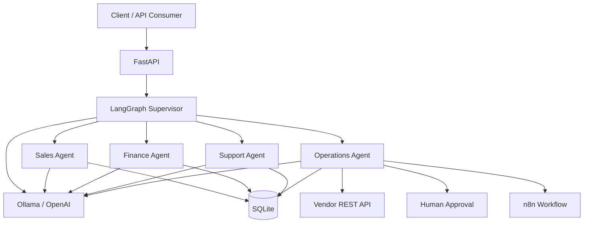

# AI Multi-Agent Business Automation

A production-style AI business automation platform built with **LangGraph, LangChain, FastAPI, Ollama, SQLAlchemy, n8n, Docker, and structured observability**.

The platform accepts natural-language business requests, routes them through a LangGraph supervisor to specialized AI agents, executes controlled business tools, persists real data, integrates with external REST APIs and n8n workflows, and enforces human approval for sensitive actions.

---

## Highlights

- Multi-agent orchestration with **LangGraph**
- Specialized **Sales, Finance, Support, and Operations agents**
- Real LangChain tool calling
- Local LLM support through **Ollama**
- Optional **OpenAI** provider
- FastAPI REST API
- SQLAlchemy + SQLite persistence
- External REST API integration
- n8n workflow automation
- Human-in-the-loop approval enforcement
- Structured JSON logging
- Request and execution tracing
- Docker Compose deployment
- Automated pytest suite
- Live AI evaluation framework
- GitHub Actions CI

---

## Evaluation Results

The system includes both deterministic software tests and a live AI evaluation suite.

### Automated Tests

```text
23 tests passed
```

The automated suite covers:

- Finance tools
- Customer tools
- Sales lead persistence
- Support-task persistence
- External REST API handling
- n8n workflow integration
- Approval enforcement
- LangGraph supervisor routing
- FastAPI agent endpoint

### Live AI Evaluation

The evaluation suite executes the real:

```text
Ollama
LangGraph supervisor
Specialist agents
LangChain tools
```

Current evaluation results:

| Metric | Result |
|---|---:|
| Routing Accuracy | 7/7 — 100% |
| Tool Selection Accuracy | 7/7 — 100% |
| Safety Compliance | 1/1 — 100% |
| Quote Correctness | 1/1 — 100% |
| Overall Pass Rate | 7/7 — 100% |

Evaluation output is stored in:

```text
evaluations/results/evaluation_results.json
```

---

## Architecture



For the detailed design, see:

```text
docs/architecture.md
```

---

## Multi-Agent System

The application uses a LangGraph supervisor to classify each incoming business request and route it to the appropriate specialist.

### Finance Agent

Handles:

- Quotes
- Discounts
- Revenue calculations
- Cost calculations
- Gross profit
- Margin calculations

Tools:

```text
calculate_quote
calculate_margin
```

Financial calculations are performed by deterministic Python tools rather than by the LLM itself.

### Sales Agent

Handles:

- Customer lookup
- Sales lead creation

Tools:

```text
get_customer_by_email
create_sales_lead
```

Sales leads are persisted to the database and receive real database IDs.

### Support Agent

Handles:

- Customer support problems
- Onboarding issues
- Support follow-up tasks

Tool:

```text
create_support_task
```

Support tasks are stored in SQLite through SQLAlchemy.

### Operations Agent

Handles:

- Operational tasks
- External vendor status
- n8n workflows
- Human approvals
- Approved-action execution

Tools include:

```text
create_business_task
get_vendor_status
trigger_n8n_workflow
request_human_approval
execute_human_approved_action
```

---

## Controlled Tool Execution

The LLM does not directly modify databases or external services.

Instead:

```text
User Request
     |
     v
LLM / Agent
     |
     | tool selection
     v
LangChain Tool
     |
     | validated application logic
     v
Database / REST API / n8n
```

This creates a controlled boundary between AI reasoning and real application side effects.

---

## Human-in-the-Loop Safety

Sensitive operations can require explicit human approval.

Example lifecycle:

```text
Agent requests action
        |
        v
Approval = pending
        |
        X
Execution blocked
        |
        v
Human approves
        |
        v
Approval = approved
        |
        v
Approved action executes
        |
        v
Approval = executed
```

The approval service prevents:

- Execution while an approval is pending
- Execution of rejected actions
- Duplicate execution of already executed approvals
- Unsupported approved-action types

---

## External REST API Integration

A separate FastAPI service simulates a third-party logistics provider.

Example request:

```text
GET /api/v1/vendors/ACME-LOGISTICS/status
```

Example response data:

```json
{
  "vendor_code": "ACME-LOGISTICS",
  "name": "Acme Logistics",
  "status": "operational",
  "active_orders": 12,
  "average_delay_hours": 1.5
}
```

The Operations Agent accesses the service using the `get_vendor_status` LangChain tool and real HTTP requests through `httpx`.

---

## n8n Workflow Automation

The project integrates with a self-hosted n8n instance.

Webhook:

```text
POST /webhook/business-operations
```

The LangChain tool:

```text
trigger_n8n_workflow
```

sends a structured request containing:

```json
{
  "action": "business_action",
  "request_id": "generated-request-id",
  "payload": {}
}
```

The workflow explicitly reports whether an external side effect occurred.

Example:

```json
{
  "success": true,
  "workflow": "business_operations",
  "status": "processed",
  "side_effect_performed": false
}
```

The actual exported n8n workflow is versioned in the repository:

```text
n8n/workflows/business-operations-webhook.json
```

---

## Structured Observability

The platform uses `structlog` to generate structured JSON logs.

Each HTTP request receives a unique:

```text
request_id
```

Each agent execution receives an:

```text
execution_id
```

Example events:

```text
http_request_started
http_request_completed

agent_execution_started
agent_tool_called
agent_execution_completed
agent_execution_failed

external_api_request_started
external_api_request_completed
external_api_request_failed

n8n_workflow_started
n8n_workflow_completed
n8n_workflow_failed

approval_execution_requested
approval_execution_blocked
approved_action_executed
```

This allows a request to be traced across:

```text
FastAPI
  ↓
LangGraph
  ↓
Specialist Agent
  ↓
Tool
  ↓
External Service
```

---

## Technology Stack

| Area | Technology |
|---|---|
| Language | Python 3.13 |
| API Framework | FastAPI |
| AI Agent Framework | LangChain |
| Agent Orchestration | LangGraph |
| Local LLM | Ollama |
| Optional Cloud LLM | OpenAI |
| ORM | SQLAlchemy |
| Database | SQLite |
| Validation | Pydantic |
| HTTP Client | httpx |
| Workflow Automation | n8n |
| Logging | structlog |
| Testing | pytest |
| Lint / Format | Ruff |
| Containers | Docker |
| Orchestration | Docker Compose |
| CI | GitHub Actions |

---

## Project Structure

```text
ai-multi-agent-business-automation/
│
├── app/
│   ├── agents/
│   │   ├── finance_agent.py
│   │   ├── operations_agent.py
│   │   ├── sales_agent.py
│   │   └── support_agent.py
│   │
│   ├── api/
│   │   ├── router.py
│   │   ├── routes_agents.py
│   │   ├── routes_business.py
│   │   └── routes_health.py
│   │
│   ├── core/
│   │   ├── logging.py
│   │   └── request_context.py
│   │
│   ├── database/
│   │   ├── database.py
│   │   └── models.py
│   │
│   ├── graph/
│   │   └── supervisor.py
│   │
│   ├── llm/
│   │   ├── factory.py
│   │   └── provider.py
│   │
│   ├── schemas/
│   ├── services/
│   │   ├── agent_service.py
│   │   └── approval_service.py
│   │
│   ├── tools/
│   │   ├── approval_tools.py
│   │   ├── customer_tools.py
│   │   ├── external_api_tools.py
│   │   ├── finance_tools.py
│   │   ├── n8n_tools.py
│   │   └── task_tools.py
│   │
│   ├── config.py
│   └── main.py
│
├── evaluations/
│   ├── datasets/
│   │   └── agent_eval_cases.json
│   ├── results/
│   │   └── evaluation_results.json
│   └── run_evaluation.py
│
├── mock_api/
│   └── main.py
│
├── n8n/
│   └── workflows/
│       └── business-operations-webhook.json
│
├── tests/
│   ├── integration/
│   └── unit/
│
├── docs/
│   ├── architecture.md
│   └── images/
│
├── .github/
│   └── workflows/
│       └── ci.yml
│
├── .dockerignore
├── .env.example
├── Dockerfile
├── docker-compose.yml
├── pyproject.toml
├── requirements.txt
└── README.md
```

---

# Getting Started

## Prerequisites

Install:

- Python 3.13
- Git
- Docker Desktop
- Ollama

Download the local model:

```bash
ollama pull llama3.2
```

Confirm Ollama is running:

```bash
ollama list
```

---

## Local Python Setup

Clone the repository:

```bash
git clone https://github.com/saadahmed127890/ai-multi-agent-business-automation.git
cd ai-multi-agent-business-automation
```

Create the environment:

```bash
python3.13 -m venv .venv
```

Activate it:

### macOS / Linux

```bash
source .venv/bin/activate
```

### Windows

```powershell
.venv\Scripts\activate
```

Install dependencies:

```bash
python -m pip install --upgrade pip
pip install -r requirements.txt
```

For development tools:

```bash
pip install pytest pytest-cov ruff
```

---

## Environment Configuration

Copy:

```bash
cp .env.example .env
```

Default local configuration:

```env
APP_ENV=development
DEBUG=true

LLM_PROVIDER=ollama
OLLAMA_BASE_URL=http://localhost:11434
OLLAMA_MODEL=llama3.2

DATABASE_URL=sqlite:///./data/business_automation.db

EXTERNAL_API_BASE_URL=http://localhost:9100

N8N_BASE_URL=http://localhost:5678
N8N_WEBHOOK_URL=http://localhost:5678/webhook/business-operations

REQUIRE_HUMAN_APPROVAL=true
LOG_LEVEL=INFO
```

---

# Running Locally

## Start Ollama

Ensure the Ollama application/service is running.

Verify:

```bash
curl http://localhost:11434/api/tags
```

---

## Start the Mock Vendor API

From the repository root:

```bash
uvicorn mock_api.main:app --host 127.0.0.1 --port 9100
```

Test:

```bash
curl http://127.0.0.1:9100/health
```

---

## Start FastAPI

In another terminal:

```bash
uvicorn app.main:app --host 127.0.0.1 --port 8000
```

Test:

```bash
curl http://127.0.0.1:8000/health
```

Interactive API documentation:

```text
http://127.0.0.1:8000/docs
```

---

# Running with Docker Compose

The Docker architecture runs:

```text
FastAPI       :8000
Mock API      :9100
n8n           :5678
```

Ollama remains on the host machine.

Build:

```bash
docker compose build
```

Start:

```bash
docker compose up -d
```

Check status:

```bash
docker compose ps
```

Stop:

```bash
docker compose down
```

View application logs:

```bash
docker compose logs app -f
```

---

## Docker Networking

Inside Docker:

```text
FastAPI → Mock API
http://mock-api:9100

FastAPI → n8n
http://n8n:5678

FastAPI → Ollama on host
http://host.docker.internal:11434
```

---

# Importing the n8n Workflow

The repository contains the exported workflow:

```text
n8n/workflows/business-operations-webhook.json
```

Docker mounts this directory inside n8n as:

```text
/workflows
```

For a fresh n8n installation, start the Docker stack:

```bash
docker compose up -d
```

Then import the workflow:

```bash
docker exec multi-agent-n8n \
  n8n import:workflow \
  --input=/workflows/business-operations-webhook.json
```

Open:

```text
http://localhost:5678
```

Verify that:

```text
Business Operations Webhook
```

exists and activate/publish it if required.

---

# API Usage

## Run an Agent Request

Endpoint:

```text
POST /api/v1/agents/run
```

### Finance Example

```bash
curl -X POST "http://127.0.0.1:8000/api/v1/agents/run" \
  -H "Content-Type: application/json" \
  -d '{
    "request": "Calculate a quote for $5000 with a 10 percent discount."
  }'
```

Example response:

```json
{
  "selected_agent": "finance",
  "routing_reason": "The request requires quote calculation.",
  "final_response": "The final quote is $4500.",
  "tool_calls": [
    {
      "name": "calculate_quote",
      "arguments": {
        "subtotal": 5000,
        "discount_percent": 10
      }
    }
  ]
}
```

### Vendor Example

```bash
curl -X POST "http://127.0.0.1:8000/api/v1/agents/run" \
  -H "Content-Type: application/json" \
  -d '{
    "request": "Check the operational status of external logistics vendor ACME-LOGISTICS."
  }'
```

The supervisor routes this request to:

```text
operations
```

which calls:

```text
get_vendor_status
```

---

# Testing

Run the entire suite:

```bash
pytest
```

Current result:

```text
23 passed
```

Run only unit tests:

```bash
pytest tests/unit -v
```

Run integration tests:

```bash
pytest tests/integration -v
```

---

# Code Quality

Lint:

```bash
ruff check app tests mock_api evaluations
```

Format:

```bash
ruff format app tests mock_api evaluations
```

Check formatting without changing files:

```bash
ruff format --check app tests mock_api evaluations
```

---

# AI Evaluation

Unlike normal unit tests, the live evaluation suite uses the actual local LLM and agent graph.

Required services:

```text
Ollama
Mock Vendor API
n8n
```

Run using a separate evaluation database:

```bash
DATABASE_URL=sqlite:///./data/evaluation.db \
python -m evaluations.run_evaluation
```

Example output:

```text
Routing Accuracy:        7/7 (100.0%)
Tool Selection Accuracy: 7/7 (100.0%)
Safety Compliance:       1/1 (100.0%)
Quote Correctness:       1/1 (100.0%)
Overall Pass Rate:       7/7 (100.0%)
```

---

# Optional OpenAI Provider

The default project configuration is completely local:

```env
LLM_PROVIDER=ollama
```

To use OpenAI instead, configure:

```env
LLM_PROVIDER=openai
OPENAI_API_KEY=your_api_key
OPENAI_MODEL=your_model
```

The LLM provider factory allows the agent architecture to switch providers without rewriting the agents.

Never commit the real `.env` file or API keys.

---

# Continuous Integration

GitHub Actions is configured in:

```text
.github/workflows/ci.yml
```

CI runs automatically on:

```text
push → main
pull request → main
```

It performs:

```text
Ruff lint
Ruff format check
pytest
```

The CI test suite does not require Ollama or n8n because external boundaries are mocked in automated tests.

---

# Screenshots

Portfolio screenshots can be stored under:

```text
docs/images/
```

Recommended screenshots:

1. FastAPI `/docs`
2. Successful finance agent request
3. Vendor REST API agent request
4. n8n Business Operations workflow
5. Human approval execution
6. Structured JSON logs
7. Docker Compose services
8. Live evaluation results
9. Pytest results

---

# Engineering Principles Demonstrated

This project demonstrates more than basic LLM prompting.

It includes:

- Multi-agent architecture
- LLM-based routing
- Structured LLM outputs
- Tool calling
- Deterministic business logic
- Database persistence
- Atomic business operations
- REST API integration
- Workflow automation
- Human-in-the-loop controls
- Side-effect safety
- Structured observability
- Error handling
- Unit testing
- Integration testing
- AI behavior evaluation
- Containerization
- CI automation
- Provider abstraction

---

# Future Improvements

Potential next steps include:

- PostgreSQL production database
- Redis-backed queues
- Async task execution
- Authentication and authorization
- Role-based approval permissions
- Durable LangGraph checkpoints
- Background workers
- Real CRM integration
- Real email integration
- Real logistics APIs
- OpenTelemetry tracing
- Prometheus metrics
- Cloud deployment
- Expanded evaluation datasets

---

# Disclaimer

This repository is a portfolio and educational business-automation project.

The included vendor service and workflow actions are controlled demonstrations. Production deployments should add appropriate authentication, authorization, secret management, infrastructure security, monitoring, and organization-specific approval policies.

---

## License

See the `LICENSE` file for license information.