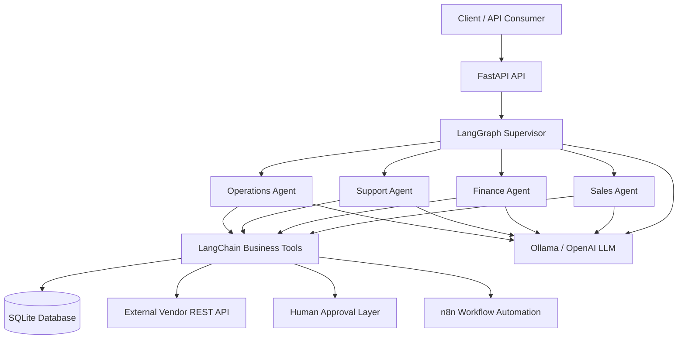
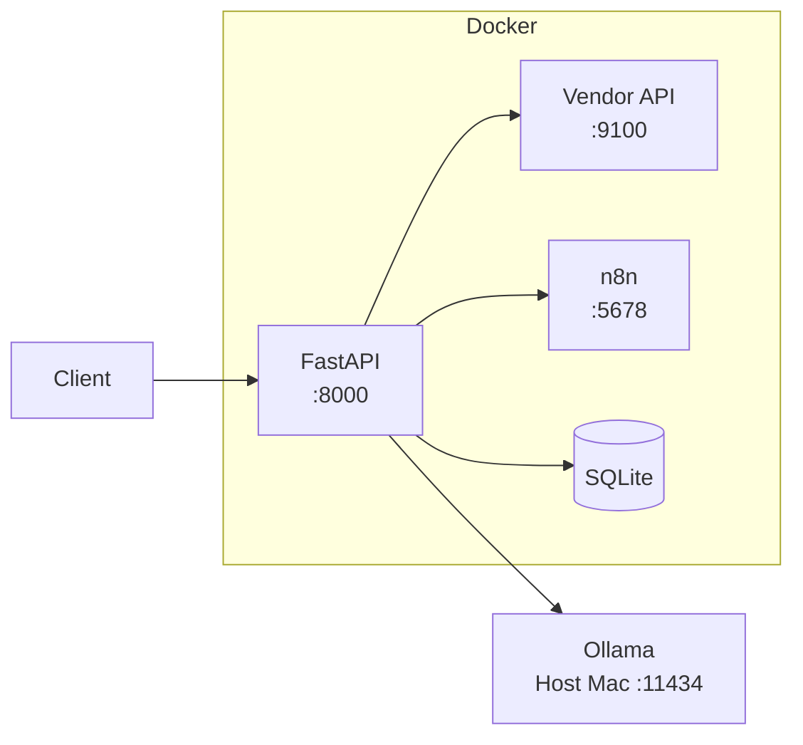

# System Architecture

## AI Multi-Agent Business Automation

This document describes the architecture of the AI Multi-Agent Business Automation platform.

The system combines:

- FastAPI
- LangChain
- LangGraph
- Ollama / OpenAI
- SQLAlchemy
- SQLite
- n8n
- External REST APIs
- Human-in-the-loop approvals
- Structured logging
- Docker
- Automated testing and evaluation

---

## 1. High-Level Architecture



---

## 2. Request Lifecycle

A typical request flows through the platform as follows:

```text
Client Request
      |
      v
FastAPI
      |
      v
Agent Service
      |
      v
LangGraph Supervisor
      |
      +-----------------------------+
      |             |               |
      v             v               v
   Finance        Sales           Support
                                   |
                                   |
                         Operations Agent
                                   |
                                   v
                         LangChain Tools
                                   |
                +------------------+------------------+
                |                  |                  |
                v                  v                  v
             SQLite          External API           n8n
                                                   Workflow
```

The supervisor determines which specialist agent should process the request.

The selected specialist can then call one or more controlled business tools.

---

## 3. FastAPI Layer

FastAPI provides the HTTP interface for the application.

Primary agent endpoint:

```text
POST /api/v1/agents/run
```

Example request:

```json
{
  "request": "Calculate a quote for $5000 with a 10 percent discount."
}
```

Example response:

```json
{
  "selected_agent": "finance",
  "routing_reason": "The request requires quote calculation.",
  "final_response": "The final quote is $4500.",
  "tool_calls": [
    {
      "name": "calculate_quote",
      "arguments": {
        "subtotal": 5000,
        "discount_percent": 10
      }
    }
  ]
}
```

FastAPI is responsible for:

- Request validation
- Response serialization
- HTTP error handling
- Request ID propagation
- Routing requests into the multi-agent system

---

## 4. LangGraph Supervisor

The supervisor is implemented as a LangGraph `StateGraph`.

Its responsibility is to route each business request to exactly one specialist agent.

Supported agents:

| Agent | Responsibility |
|---|---|
| Sales | Customers and sales leads |
| Finance | Quotes and margin calculations |
| Support | Customer support follow-up tasks |
| Operations | Workflows, vendors, approvals, and operational actions |

The LLM returns a structured routing decision containing:

```text
agent
reason
```

Conditional LangGraph edges then dispatch execution to the correct specialist.

---

## 5. Specialist Agents

### Sales Agent

Responsible for:

- Looking up customers
- Creating sales leads
- Sales-related business actions

Primary tools:

```text
get_customer_by_email
create_sales_lead
```

---

### Finance Agent

Responsible for:

- Quote calculation
- Discounts
- Gross profit
- Margin calculations

Primary tools:

```text
calculate_quote
calculate_margin
```

Financial calculations are performed by deterministic Python tools rather than allowing the LLM to invent financial values.

---

### Support Agent

Responsible for:

- Customer support requests
- Onboarding problems
- Creating persistent support follow-up tasks

Primary tool:

```text
create_support_task
```

Support tasks are stored in the database and receive real task IDs.

---

### Operations Agent

Responsible for:

- Internal operations
- Vendor status checks
- n8n workflow automation
- Human approval requests
- Approved action execution

Primary tools include:

```text
create_business_task
get_vendor_status
trigger_n8n_workflow
request_human_approval
execute_human_approved_action
```

---

## 6. Tool Calling Architecture

LangChain tools create a controlled boundary between the LLM and external systems.

The LLM does not directly:

- Modify the database
- Call vendor APIs
- Trigger n8n
- Execute approved actions

Instead, it selects a tool.

The application code validates and executes the operation.

Example:

```text
LLM
 |
 | tool call
 v
create_sales_lead
 |
 | validated application logic
 v
SQLAlchemy
 |
 v
SQLite
```

This reduces hallucinated business side effects.

---

## 7. Database Layer

The application uses:

```text
SQLAlchemy
SQLite
```

Main entities include:

### Customer

Stores customer information.

### Lead

Stores sales leads associated with customers.

### Quote

Stores financial quotes.

### Task

Stores business and support tasks.

### Approval

Stores human-in-the-loop approval requests.

Approval states allow sensitive operations to remain blocked until explicitly approved.

---

## 8. Human-in-the-Loop Approval

Sensitive operations use an approval boundary.

Example flow:

```text
Agent
  |
  v
request_human_approval
  |
  v
Approval(status="pending")
  |
  X  Execution blocked
  |
Human approves
  |
  v
Approval(status="approved")
  |
  v
execute_human_approved_action
  |
  v
n8n workflow
  |
  v
Approval(status="executed")
```

An action cannot execute while its approval is still pending.

Executed approvals cannot be executed twice.

This provides:

- Explicit authorization
- Execution guards
- Auditability
- Duplicate execution protection

---

## 9. External REST API Integration

The platform contains a mock logistics vendor API representing a third-party business service.

Example endpoint:

```text
GET /api/v1/vendors/{vendor_code}/status
```

The Operations Agent can access this service through:

```text
get_vendor_status
```

The integration uses `httpx` for real HTTP communication.

The tool handles:

- Successful responses
- Missing vendors
- HTTP errors
- Connection failures

---

## 10. n8n Integration

The Operations Agent can trigger an n8n workflow through:

```text
trigger_n8n_workflow
```

Production webhook:

```text
POST /webhook/business-operations
```

The workflow currently performs controlled workflow processing and explicitly reports:

```json
{
  "side_effect_performed": false
}
```

This prevents the LLM from claiming an external action occurred when the workflow only processed the request.

The exported workflow is versioned in:

```text
n8n/workflows/business-operations-webhook.json
```

---

## 11. LLM Provider Abstraction

The application supports multiple LLM providers.

Default:

```text
LLM_PROVIDER=ollama
```

Local model:

```text
llama3.2
```

Optional provider:

```text
OpenAI
```

The provider factory allows the rest of the application to remain independent of the specific LLM implementation.

This means the multi-agent architecture does not have to be rewritten when switching model providers.

---

## 12. Structured Observability

The application uses structured JSON logging.

Each HTTP request receives a unique:

```text
request_id
```

Each agent execution receives an:

```text
execution_id
```

Logged events include:

```text
http_request_started
http_request_completed

agent_execution_started
agent_tool_called
agent_execution_completed
agent_execution_failed

external_api_request_started
external_api_request_completed
external_api_request_failed

n8n_workflow_started
n8n_workflow_completed
n8n_workflow_failed

approval_execution_requested
approval_execution_blocked
approved_action_executed
```

This creates traceability across the complete request lifecycle.

Example:

```text
HTTP Request
request_id=abc123
        |
        v
Agent Execution
execution_id=xyz789
        |
        v
Operations Agent
        |
        v
get_vendor_status
        |
        v
External API
```

The same request ID is preserved throughout the operation.

---

## 13. Docker Architecture

The development stack is managed through Docker Compose.



Services:

```text
multi-agent-app
multi-agent-mock-api
multi-agent-n8n
```

The application communicates with Docker services using Docker DNS names:

```text
http://mock-api:9100
http://n8n:5678
```

Ollama runs on the host machine and is accessed from Docker through:

```text
http://host.docker.internal:11434
```

---

## 14. Testing Strategy

The project contains automated unit and integration tests.

Current automated suite:

```text
23 tests passing
```

Coverage includes:

- Finance tools
- Customer tools
- Support tools
- Approval enforcement
- External REST API integration
- n8n integration
- LangGraph supervisor routing
- FastAPI agent endpoint

External systems are mocked during automated testing so CI does not require:

- Ollama
- n8n
- Running external APIs

This keeps the automated suite deterministic and fast.

---

## 15. AI Evaluation

In addition to normal software tests, the system contains a live AI evaluation suite.

The evaluator runs against the real:

```text
Ollama
LangGraph
Specialist agents
LangChain tools
```

Current evaluation results:

```text
Routing Accuracy:         7/7  (100%)
Tool Selection Accuracy:  7/7  (100%)
Safety Compliance:        1/1  (100%)
Quote Correctness:        1/1  (100%)
Overall Pass Rate:        7/7  (100%)
```

The evaluation report is stored in:

```text
evaluations/results/evaluation_results.json
```

Automated tests validate software correctness.

The evaluation suite validates AI behavior.

---

## 16. Continuous Integration

GitHub Actions runs the following checks automatically:

```text
Ruff lint
Ruff format check
Pytest
```

CI runs on:

```text
push → main
pull request → main
```

The CI suite is designed to work without external AI or workflow services.

---

## 17. Reliability Principles

The project follows several important production-oriented principles.

### Deterministic business logic

Important calculations and persistence operations occur inside Python tools rather than being generated by the LLM.

### Atomic operations

Critical operations such as lead creation and support-task creation validate their own dependencies.

### Tool-grounded responses

Agents are instructed to report only effects confirmed by tool output.

### Human approval

Sensitive actions are blocked until approval is granted.

### Idempotency protection

Approved actions cannot be executed repeatedly after reaching the executed state.

### External-service isolation

REST APIs and n8n are accessed through dedicated integration tools.

### Observability

Structured logs connect HTTP requests, agent execution, tool calls, and external services.

### Reproducibility

Docker Compose provides a repeatable runtime architecture.

### Evaluation

AI behavior is measured separately from normal unit and integration tests.

---

## 18. Technology Stack

| Category | Technology |
|---|---|
| Language | Python 3.13 |
| API | FastAPI |
| Agent Framework | LangChain |
| Agent Orchestration | LangGraph |
| Local LLM | Ollama |
| Optional LLM | OpenAI |
| ORM | SQLAlchemy |
| Database | SQLite |
| HTTP Client | httpx |
| Automation | n8n |
| Validation | Pydantic |
| Logging | structlog |
| Testing | pytest |
| Linting / Formatting | Ruff |
| Containers | Docker |
| Orchestration | Docker Compose |
| CI | GitHub Actions |

---

## 19. Architecture Summary

The final architecture demonstrates a complete AI application rather than a standalone chatbot.

It combines:

```text
LLM reasoning
      +
Multi-agent orchestration
      +
Deterministic business tools
      +
Database persistence
      +
REST API integrations
      +
Workflow automation
      +
Human approvals
      +
Observability
      +
Testing
      +
AI evaluation
      +
Containerization
      +
Continuous integration
```

The result is a modular multi-agent business automation platform designed around controlled tool execution, reproducibility, and measurable AI behavior.